# Feb

### [2018 NIPS] Context-Aware Synthesis and Placement of Object Instances [→](https://papers.nips.cc/paper/8240-context-aware-synthesis-and-placement-of-object-instances.pdf)

| input/output                               | where/what                                 |
| ------------------------------------------ | ------------------------------------------ |
| 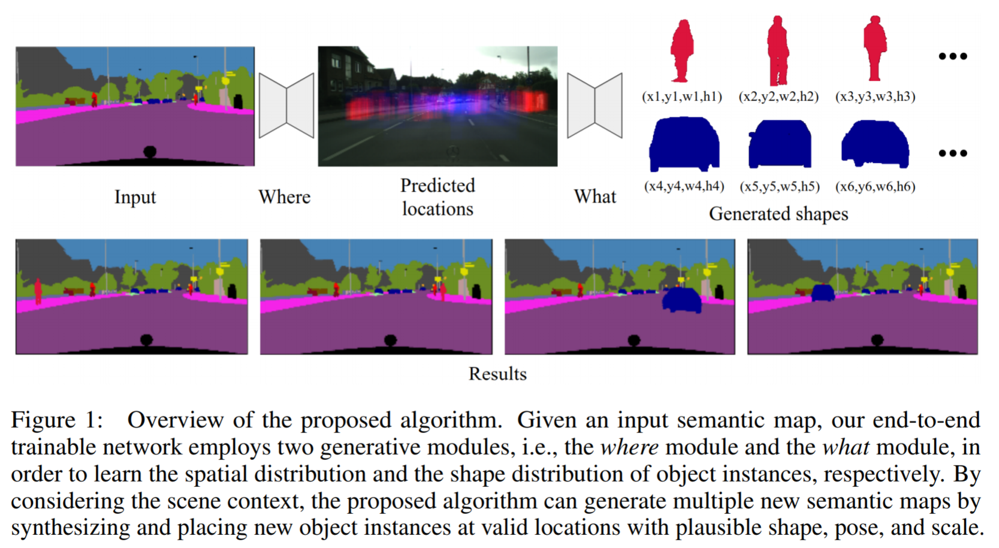 | 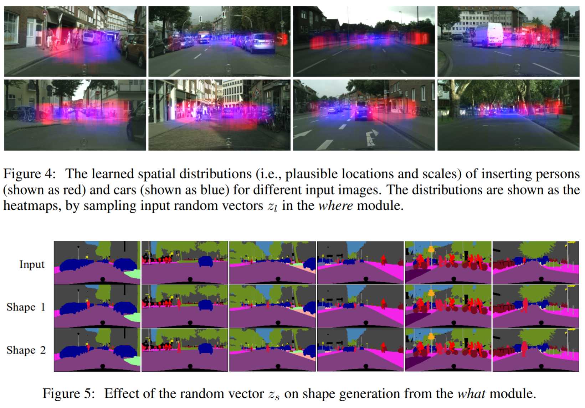 |
| **where**                                  | **what**                                   |
| 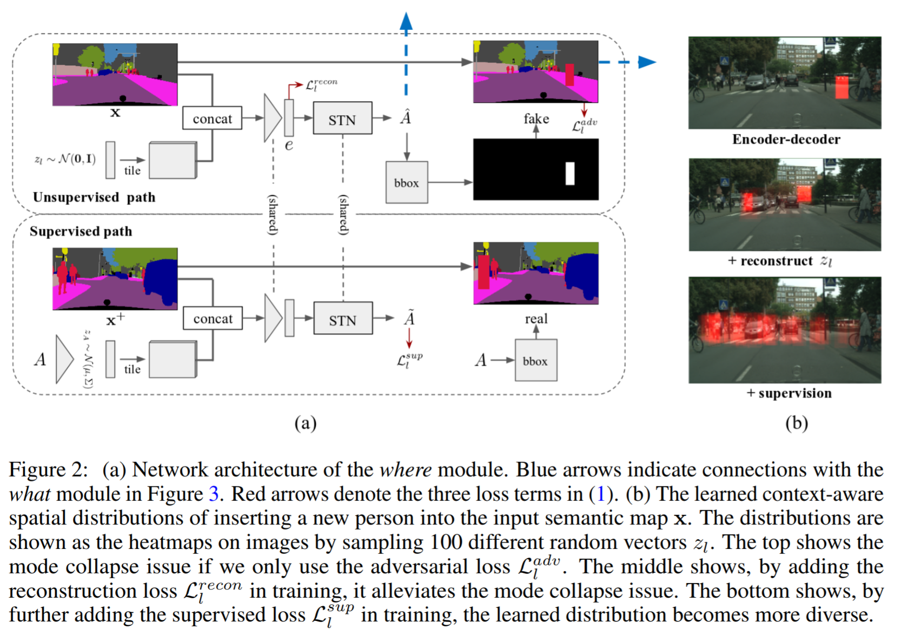 | 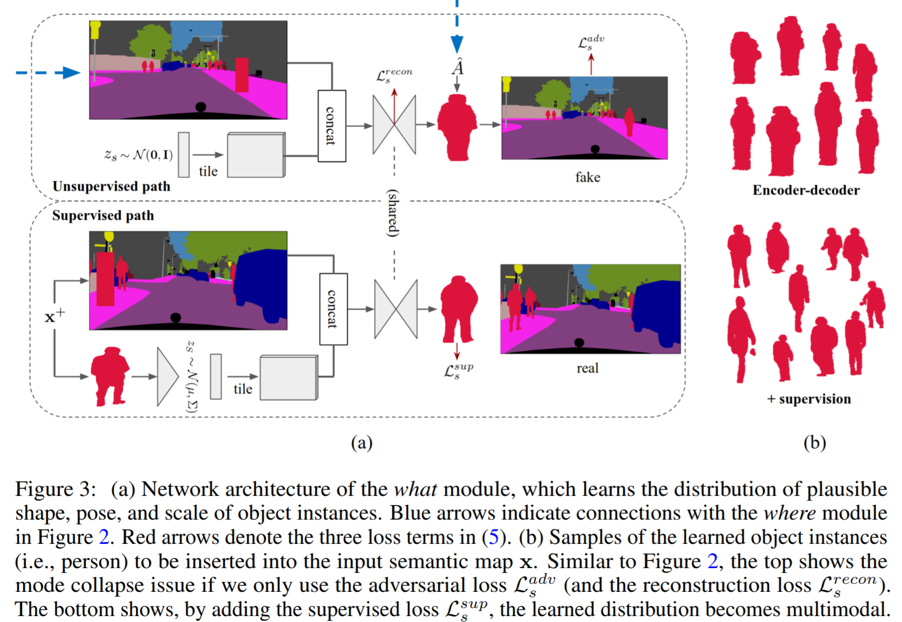 |

- Input: semantic segmentation map + category (person/car)
- Output: 2D bbox + shape outline
- Method:
  - *where*:
    - G: conditional GAN, use STN to generate an affine transformation on a unit bbox, based on input RGB image (`A' = G1(x, z1)`). Input image, output affine transform (bbox) `A'`
    - D: 
      1. adversarial: is `image + A'(bbox)` real?
      2. reconstruction: reconstruct `x` and `z1` from their joint encoding 
      3. supervised: `A == A'`? `KL(zA||z1)`? is `A'` real?
  - *what*:
    - G: conditional GAN, input image+bbox, output shape mask `s`
    - D: similar to *where*
  - Final: `x' = x + A'(s)`
- Baselines:
  - Directly generate instance at somewhere
  - First what, then where
- Evaluation:
  - User study
  - Render RGB image from semantic map, then use context-based object detector (YOLOv3) to detect the inserted object, calculate accuracy

### [2018 ECCV] Compositing-aware Image Search [→](https://hszhao.github.io/papers/eccv18_cais.pdf)

| input/output                               | outline                                    |
| ------------------------------------------ | ------------------------------------------ |
| 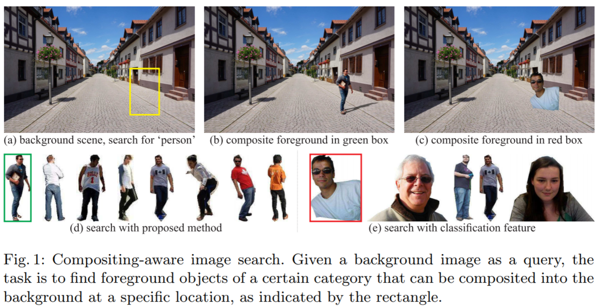 | 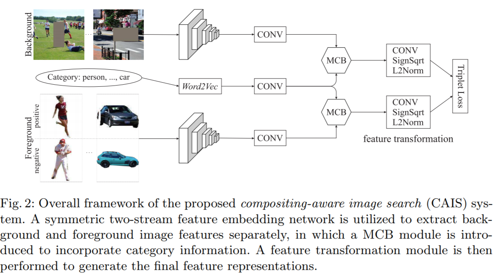 |

- Input: RGB image + category + location + object library
- Output: ordered segments (*no background context required at test time*)
- Method (matching only):
  - Network: 
    - f1 = MCB(resnet50(bg), embed(word)), f2 = MCB(resnet50(fg), embed(word)), score = |f1 - f2|^2
    - triplet\_loss = max(0, score\_p - score\_n + a) 
  - Dataset:
    - images: MS-COCO/PASCAL VOC/ADE20K
    - categories (*8): person, car, boat, dog, plant, bottle, chair, painting
    - Aug1: randomly expand the bbox, change aspect ratio
    - Aug2: triple extension (+7%)
      1. semantic context: L2 distance of background context ResNet50 feature
      2. shape information: IoU of masks
  - Blending: Poisson blending
- Baselines:
  - RealismCNN: rank by realism score of Poisson-blended result
  - Shape feature: IoU score of center-aligned bboxes
  - Classification feature: feature from classification (commonly used for image retrieval) 
- Evaluation:
  - 10 bg/category, 1 box/bg, 100-400 fg/category, 16-140 gt/bg
  - metric: mAP

### [2007 SIGGRAPH] Photo Clip Art [→](http://graphics.cs.cmu.edu/projects/photoclipart/)

| UI                                         | outline                                    | camera pose                                |
| ------------------------------------------ | ------------------------------------------ | ------------------------------------------ |
| 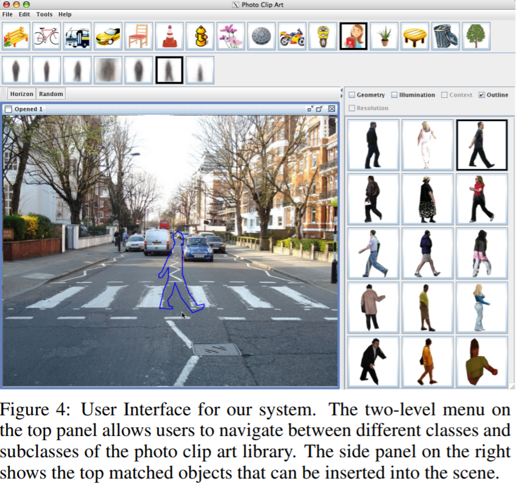 | 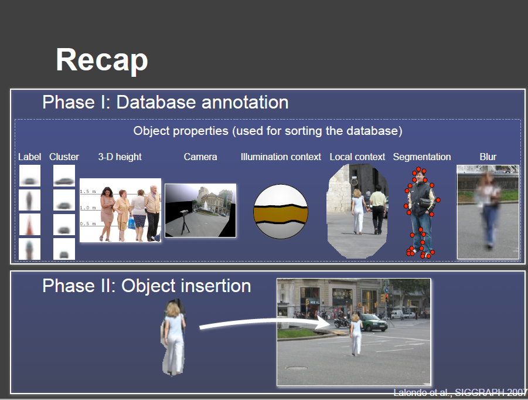 | 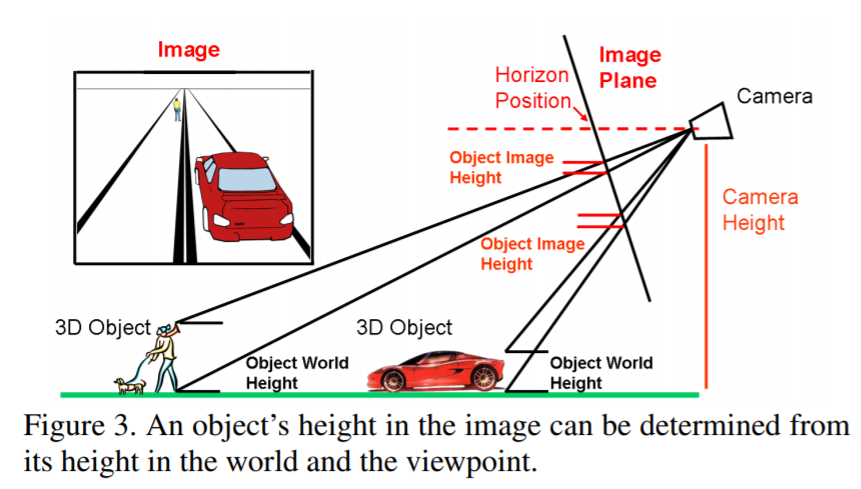 |

- Input: RGB image + category + location + object library + horizon (labeled)
- Output: ordered segments + blending
- Method:
  - Matching
    - camera orientation: pose = (3D camera height, 2D horizon), from >=2 objects with known 3D heights
      [Assume: labeled horizon & image plane roughly ⊥ ground & insert on ground & small roll]
    - lighting: X2-distance of LAB histogram of (building, sky, ground) 
    - local context: summed-squared-distance of surrounding pixels 
    - others...
  - Blending
    - segmenting --> shade transfer --> blending
- Application: decorating & enrich the scene (e.g. architectural renderings)
- Limitation: won't work indoors... (assumption for camera pose x)

# Jan

## 1.14 TODO

- `P(B, C | I) = P(C | I) P(B | C, I)`
- 后者：可以在segmentation产生的heatmap上枚举所有包围盒B，取内部heat值最大的B为选取对象（虽然之前的paper不是这样实现的）
- 前者：各个C的heatmap都是normalized的，可能无法直接对比不同C的heatmap
  - 一个简单的解决方案是按照其他物体的co-occurrence + 一些heuristic规则进行排序
  - 如：场景中有`{desk, laptop, keyboard, wall}`
  - 按照`desk`和`wall`的面积确定`mouse`和`clock`的先后顺序
  - 但这样还是未完全利用位置信息

1. `P(C | I)`
2. `P(I | C)`
3. `P(B | C, I)`：
   - best box：枚举？（无法直接解决）
   - heatmap：segmentation mask，每类一个

## Useful

### [2017 CVPR] Weakly Supervised Affordance Detection :star:

通过CNN分割 + Grabcut refine从弱标注（仅key point）的RGB图像中预测affordance map

数据集：**CAD120（RGBD，6 affordances / 10K objects / 3K images）** + UMD part affordance（ICRA'15，专注于工具部件）

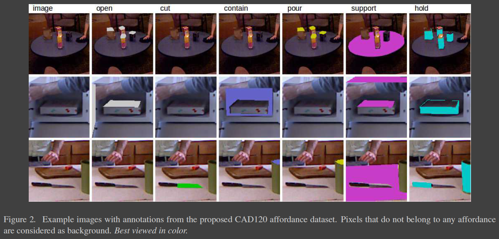

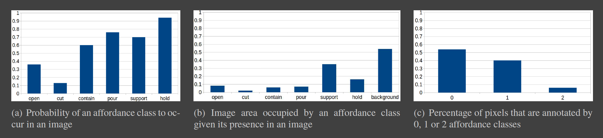

### [2017 CVPR] Learning to Segment Affordances :star:

> A key observation of this work is that **affordances** tend to pertain to single **parts of objects** rather than objects as a whole.

> In contrast to the presented methods, our approach predicts a larger number of affordances using a novel training method that explicitly makes use of **part** information. We focus on directly predicting affordances **without incorporation any hint of scene geometry.**

通过检测object part从RGB图像中预测affordance map（基于规则映射到object part上）

数据集：ADE20K + data augmentation（从大图中随机切一些patch调一调颜色等）

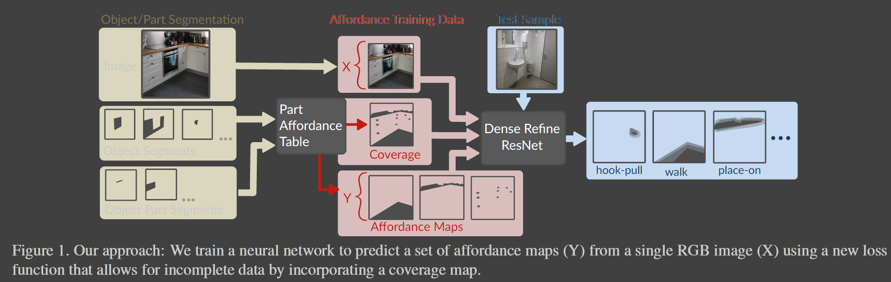

| 15 Affordances (mapped to objects / object-parts)，例如任何形如xx/top的object-part都具有place-on的affordance | Affordance results                         |
| ------------------------------------------------------------ | ------------------------------------------ |
| 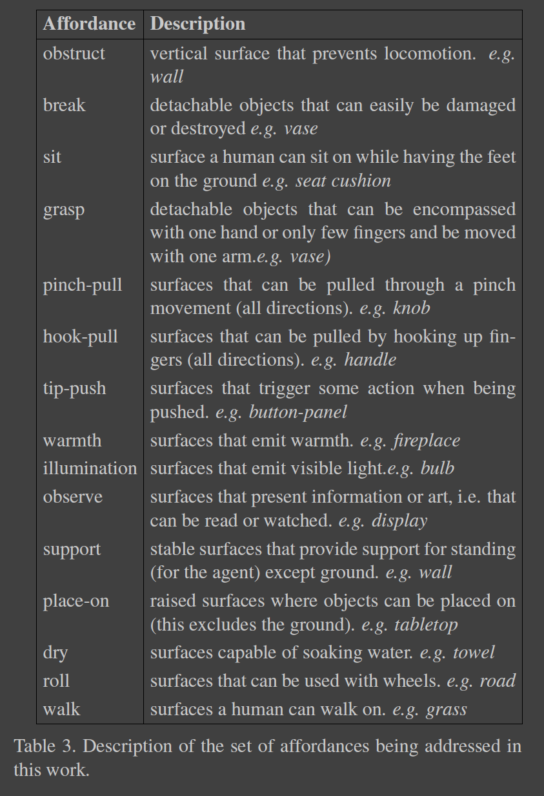                   | 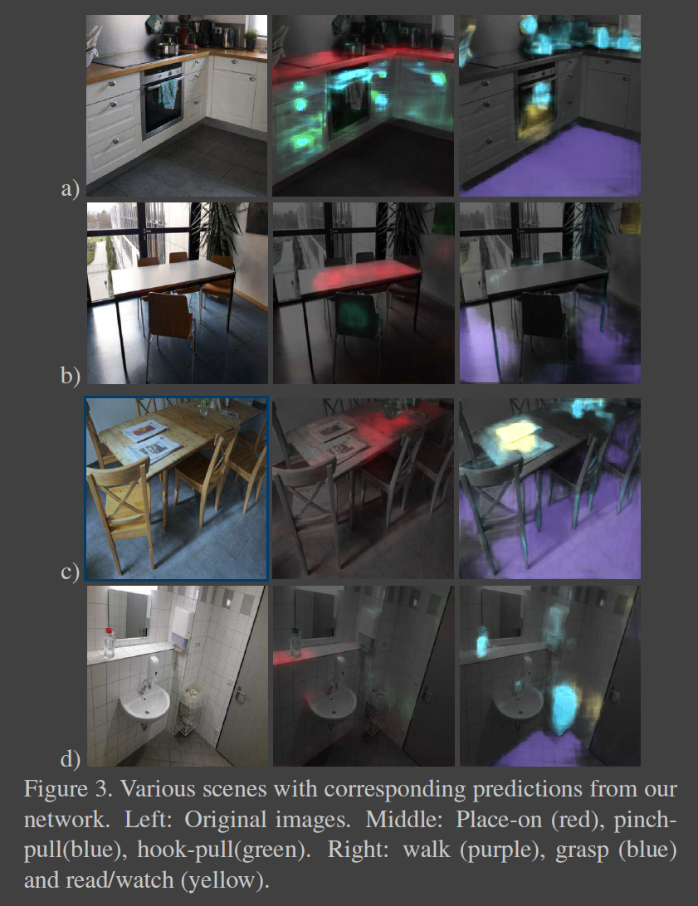 |

### [2017 CVPR] Scene Parsing through ADE20K Dataset 

数据集：ADE20K，最大的scene + object + object-part数据集。**（RGB，900种scene / 150+类物体 / 很多类part / 20K train + 2K valid + 3K test）**，来源LabelMe + SUN + Places 

[[Webpage]](http://groups.csail.mit.edu/vision/datasets/ADE20K/) [[Leaderboard]](http://sceneparsing.csail.mit.edu/) [[Explorer](http://groups.csail.mit.edu/vision/datasets/ADE20K/dataset_browser/)]

- 包含了桌面等object part的标注
- 但trainset中的object part只有一小部分有标注（8K table VS 0.8K tabletop / 1.3K desk VS 33 desktop / 400 countertop）
- 室内 / 室外均有

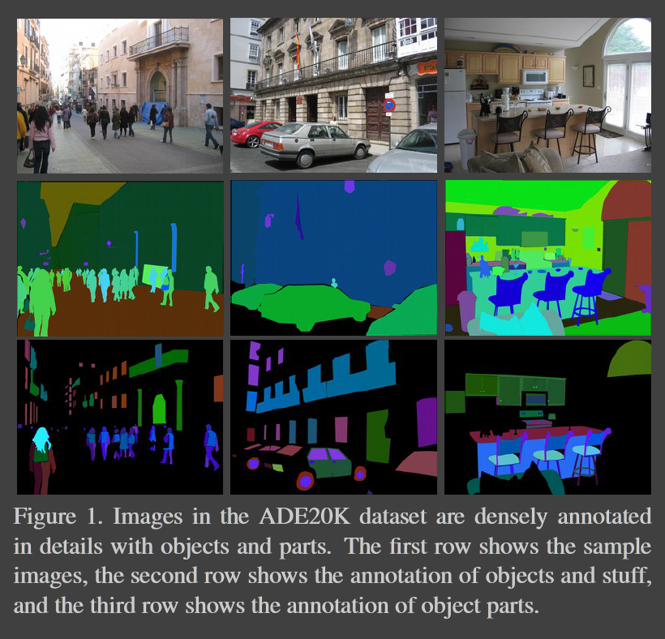

## Others

### [2016 ECCV] A Multi-Scale CNN for Affordance Segmentation in RGB Images

>  By **affordance**, we mean an object's capability to **readily** support a certain **human action**, without requiring precursor actions.

利用3D信息（depth + normal + segmentation）从RGB输入图像中预测affordance map（以像素级别的mask表示，共5种）。这不能通过object label直接映射得到，因为：
1. **object part**: 同一object的不同part的affordance不同，如椅背不sittable
2. **spatial context**: 同一object的affordance受到context影响，如桌下的椅子不sittable

数据集：**NYUv2（RGBD，40类indoor物体 / 5种affordance / 1.4K个图），场景复杂有拥挤遮挡**

数据标注：先利用RANSAC从RGBD抽平面 + 简单规则（NYUv2自带object label + 平面大小 + 平面高度 + 上方/侧面是否已有其他物体）得粗略结果，再人工修正（AMT）

| 输入输出、pipeline                                     | 5种affordance                        |
| ------------------------------------------------------ | ------------------------------------ |
| 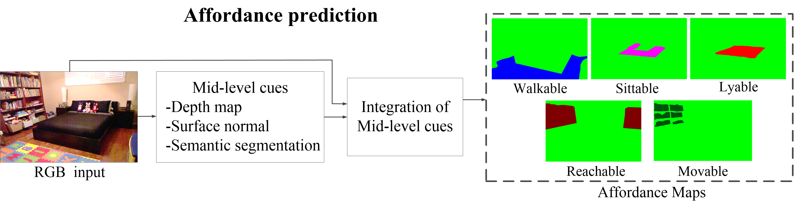 | 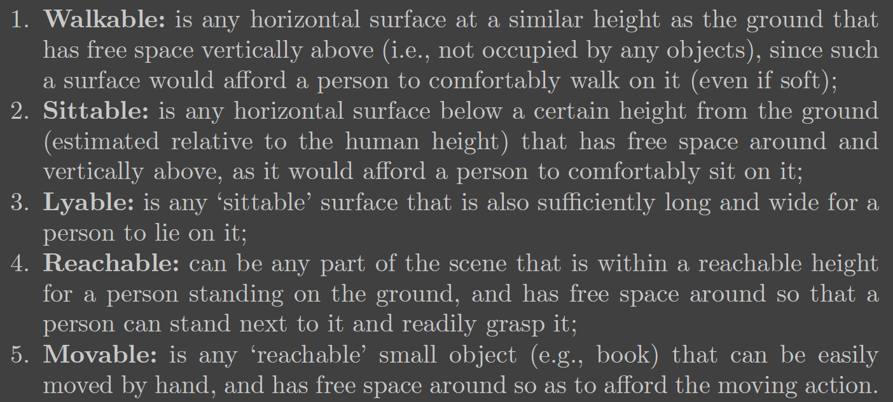 |

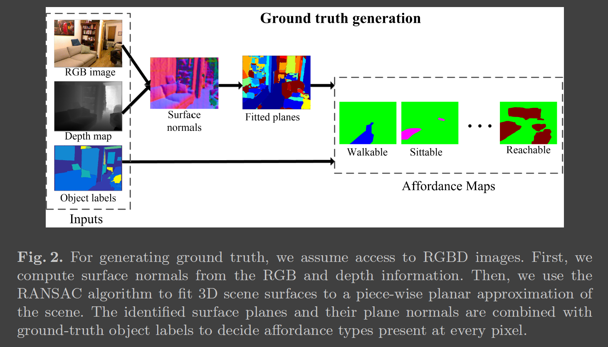

### [2017 IROS] Object-Based Affordances Detection with CNN and Dense CRF

利用CNN分割 + CRF精修从RGB输入图像中预测affordance（9种）。

新标数据集**IIT-AFF（RGBD，10种物体 / 9种affordance / 8K个图 / 14K个包围盒）**，来源ImageNet (RGB) + Asus (RGBD) + MultiSense (RGBD)。

其中的support看起来不太符合我们任务要求；display可用于广告推荐但我们目前没有考虑这类情形。

| Object distribution                        | Affordance distribution                    | Affordance说明                             |
| ------------------------------------------ | ------------------------------------------ | ------------------------------------------ |
| 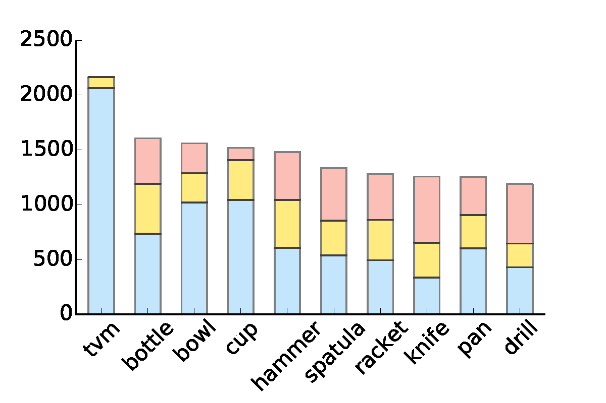 | 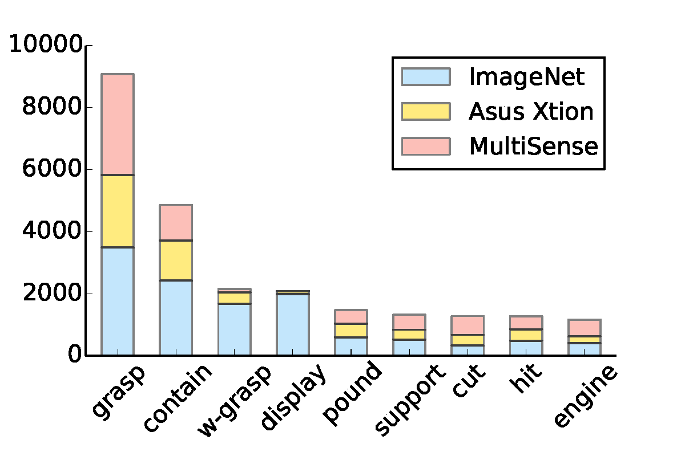 | 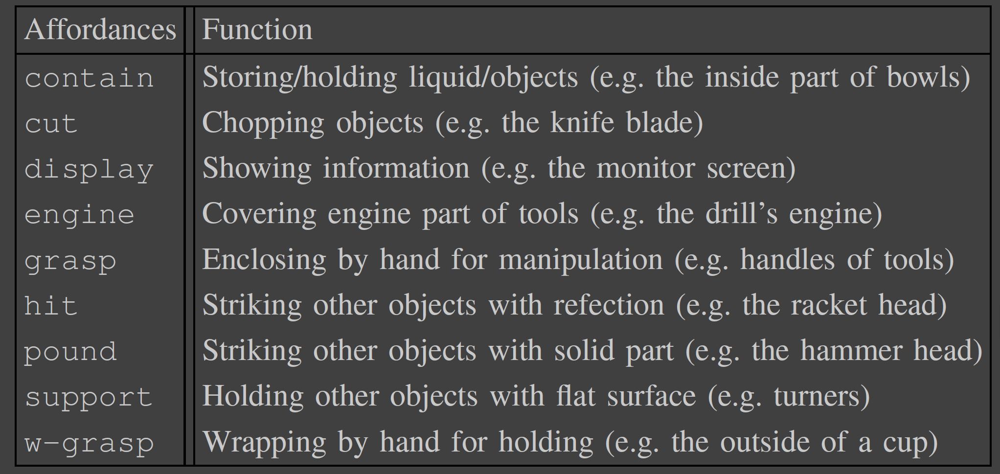 |

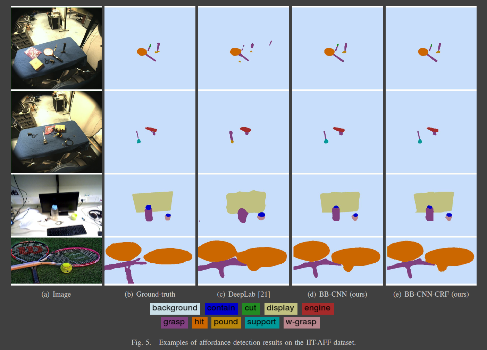

### [2015 ICRA] Affordance Detection of Tool Parts from Geometric Features

数据集：**（RGBD，17种工具 / 7种affordance / 105个场景 / 1W张图），专注于工具part的affordance（而非家具）**

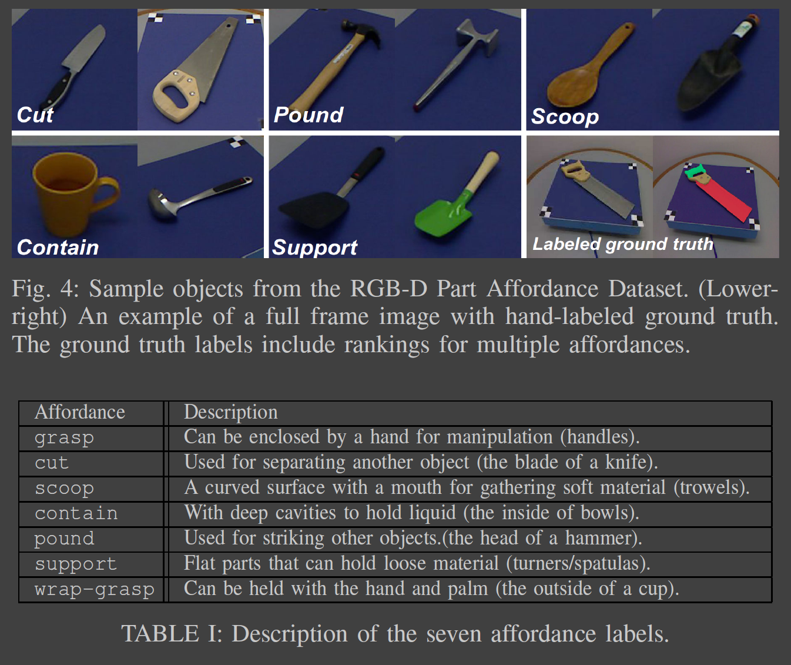